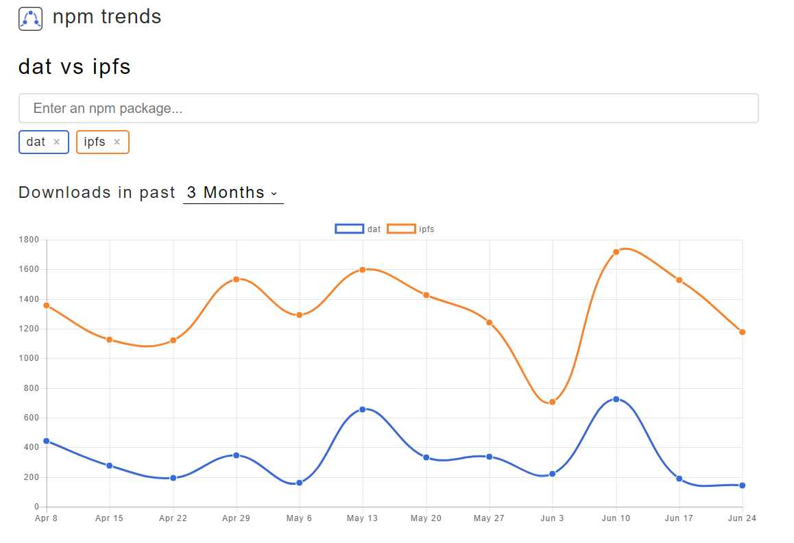

# Dezentrale Anwendungen

## Patrick Lukas Starzynski
### 02.07.2018

# Agenda

- (De)-Zentralisierung des Internets

- IPFS

- DAT

- Fazit

- Softwaredemo

## Das Internet

- Idee Arpanet: Dezentralisierung der Kommunikation

- Teilvermaschtes System

	

- Verbindung A zu C über B, wenn B nicht verfügbar existiert ein Pfad von A nach D nach C

## Dezentralisierung

- Prognose für 2017: 8,4 Mrd. Onlinegeräte

- Zensur von Services wie z.B. Wikipedia

- Was wäre wenn Alphabet Inc., Facebook, Amazon.com alle Dienstleistungen einstellen würden?

=> Zentralisierung an Knotenpunkten

# IPFS

- Peer-to-Peer-Protokoll

- Konzept zum Aufbau einer Netzinfrastruktur

- Identifizierte HTTP-Probleme:

  1. Das Hosten und Verteilen von Datenmengen im Petabytebereich
  
  2. Die Verarbeitung von großen Datenmengen innerhalb einer Organisation
  
  3. On-Demand und/oder Echtzeitstreams
  
  4. Versionierung und Verlinkung von großen Datenmengen
  
  5. Dem versehentlichen Löschen von wichtigen Dokumenten

- Kombination bekannter Systeme, wie DHTs, BitTorrent, Git und SFS

## Distributed Hash Tables

- Verteilte Hashtabelle, bildet Speicherorte von Dateien ab
- Coral DSHT, Kademlia DHT bzw. S/Kademlia DHT
1. Kademlia
	- 160-Bit Key, einmalig, vergleichbar mit UUID
	- XOR-Verknüpfung von Knoten IDs zur Präfixgenerierung z.B. 0011
	- Betrachtet Knoten als Blätter eines binären Baumes
	
2. Coral DSHT
	- Hierarchische Hashtabellen in Abhängigkeit von Größe und Region
	
3. S/Kademlia
	- Public Key Infrastruktur zum Ausstellen, Verteilen und Prüfen
	- Schlüsselpaare zum Signieren von Netzwerknachrichten

## BitTorrent
- Belohnt aktive teilnehmende Knoten 

- Priorisiert seltene Chunks

- BitSwap Protocol:
	- `want_list` und `have_list`
	
## Git

- Merkle DAG

- Immutable Objects:
	- Dateien (blobs)
	- Verzeichnisse (tree)
	- Veränderungen (commits)
	

## SFS

- Self-Certified Files

- `sfs/<Location>:<HostID>`

- `HostID = hash(public_key || Location)`

## Aktueller Stand

- Alphastadium

- Go, JavaScript, Python

	- Go: Referenz
	- JavaScript: Unvollständig
	- Python u. C: Beginnend
	
- Spiegelungen von Wikipedia

- "viele" dezentrale Anwendungen wie Datenbanken oder Chats

- Integration in Blockchain (siehe Filecoin)

## IPFS-CLI

- `ipfs cat`, `ipfs ls`, `ipfs add`, `ipfs pim rm`, `ipfs repo gc`

- Daemon zur Interaktion mit dem Netzwerk

- HTTP-Gateway `<GATEWAY>/ipfs/<HASH>`

- IPNS `ipfs name publish <HASH>`

	

## WebUI

- Erfordert IPFS-Daemon
	- `localhost:5001:/webui`

- Tool zur Visualisierung und Konfiguration

# DAT

- Datensynchronisationsprotokoll

- Fokus auf Synchronisation und Versionierung

- Kombination bekannter Systeme, wie DHTs, BitTorrent, Git, Peer-to-Peer Streaming Peer Protocol, WebTorrent

## Peer-to-Peer Streaming Peer Protocol (PPSPP)

- Legt Reihenfolge der Daten durch Generierung eines Merkle Tree fest

- BitTorrent legt keine Reihenfolge fest 

- Konzipiert für Videostreaming, auch geeignet für große Datenmengen

## WebTorrent

- BitTorrent nutzt UDP-Sockets
=> steht in JavaScript nicht zur Verfügung

- WebRTC-Protokoll:
	- Protokoll zum Austauschen von Blöcken
	- Trackerprotokoll zur Klassifizierung von Peers

## DAT Links

- Daten durch Hashwerte referenziert

- 32-Byte-Public-Key 

- Keine Authentifikationsmechanismen

## Hypercore

- Modul, implementiert:
	- Speicherung
	- Datenintegrität
	- Protokoll zur Netzwerknutzung
	
- Aufbauend ist Hyperdrive als Abstraktionsschicht zur Datenrepräsentierung

- Daten in Chunks geteilt und im Merkle Tree angeordnet

## DAT CLI

- `dat clone dat://<LINK><DOWNLOAD_VERZEICHNIS>`

- `dat share <VERZEICHNIS>`

- `dat pull` u. `dat sync`

## Hashbase und HTTP-Gateway

- Hashbase spiegelt DAT-Repository

- inkludiert `dat sync --http`

## Beakerbrowser

- Generierung von DAT-Repositories durch Browserwerkzeuge:

- Forken von Repositories:

# Fazit

- (Noch) Keine echte Alternative zu HTTP

- Integration in verbreitete Webbrowser durch Gateways

- Aktuell keine Sicherheits- oder Authentifikationsmechanismen

- Wenig Kontrolle über verteilte Daten, explizit darüber was verteilt wird

- IPFS und DAT schwer vergleichbar, da anderer Fokus

- IPFS weiter verbreitet als DAT

	

